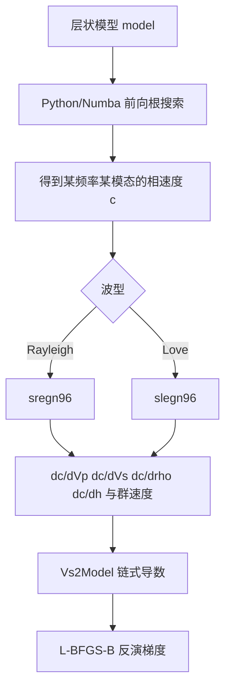

# 2026-6-4 CPS 的 `sregn96` 与 `slegn96` 说明文档

## 1. 文档目的

本文档专门说明参考项目中使用到的 CPS Fortran 核函数程序 `sregn96` 与 `slegn96`。文档内容包含它们在表面波反演中的作用、基本理论背景、输入输出含义、在 Windows 下如何编译成 DLL，以及 Windows 版 `QEDispInv-win` 中如何通过 Python 直接调用这些 DLL。本文不只是罗列命令，而是把“从理论到调用”的整条链路串起来，便于后续维护、迁移环境和检查数值一致性。

## 2. 它们在整个反演流程中的位置

QEDispInv 的完整流程可以分成两大部分。第一部分是前向色散计算，它回答的是“给定层状模型后，在某个频率和模态上，相速度应该是多少”。第二部分是核函数与梯度计算，它回答的是“如果把某一层的 `Vp`、`Vs`、密度或层厚略微改动一点，相速度会朝哪个方向、按多大幅度变化”。前者负责生成理论色散曲线，后者负责把数据残差传回模型参数，构成反演所需的梯度。

`sregn96` 与 `slegn96` 正是第二部分的核心。它们并不负责在全频带上搜索全部根，而是在某一个已经确定的频率 `f` 和相速度 `c` 处，围绕该根计算群速度、特征函数以及对模型参数的偏导数。换句话说，它们需要的前提是“这一个模态点已经被找到”，随后它们再告诉我们“这个模态点对模型有多敏感”。

在当前 Windows 版中，这条链路可以概括为：先由 `dispersion.py` 求得色散根，再由 `fortran_kernels.py` 调用 `sregn96/slegn96` 计算核函数，最后由 `inversion.py` 把核函数与 `Vs2Model` 的经验关系导数组合成目标函数梯度。



## 3. 理论背景与基本原理

### 3.1 表面波特征方程与色散根

在分层介质中，Rayleigh 波和 Love 波都满足各自的特征方程，也常被称为世俗方程或色散方程。它的抽象形式可以写成：

\[
F(\omega, c, m) = 0
\]

其中 `\omega = 2\pi f` 为角频率，`c` 为相速度，`m` 代表层状模型参数集合。对于给定频率和给定模型，满足这个方程的 `c` 就是某一支模态的相速度。

QEDispInv 的前向部分负责在频率轴上找到这些根，而 `sregn96/slegn96` 则是在根已经确定之后，对这个根附近的能量分布和参数敏感性做进一步分析。它们本质上是在“特征方程已满足”的条件下，继续计算该本征态对应的位移、应力和参数偏导。

### 3.2 Love 波与 `slegn96`

Love 波只涉及 SH 极化，因此状态变量规模较小。对于各层介质，SH 波场可以通过层内传播矩阵和层间连续条件逐层向上传递。CPS 的 `slegn96` 使用的是经典传播矩阵方法，它将每一层的 SH 解写成指数传播形式，然后用层间位移与剪应力连续条件构造总系统响应。根一旦给定，程序就可以反推出该根对应的位移特征函数、应力特征函数，以及相速度对 `Vs`、密度和层厚的偏导数。

Love 波这里最重要的物理点在于：它对 `Vp` 不敏感，因为 SH 波本身不涉及纵向耦合。所以 `slegn96` 的输出里只有 `dc/dVs`、`dc/drho` 和 `dc/dh`，没有 `dc/dVp`。

### 3.3 Rayleigh 波与 `sregn96`

Rayleigh 波属于 P-SV 耦合问题，状态变量比 Love 波更大，因为既要考虑径向位移和垂向位移，也要考虑对应的应力分量。`sregn96` 同样采用传播矩阵思想，只不过矩阵规模更大，且层内传播既包含 P 波垂向波数，也包含 SV 波垂向波数，因此对数值稳定性和归一化处理要求更高。

对 Rayleigh 波来说，相速度同时受 `Vp`、`Vs`、密度和层厚影响，因此 `sregn96` 能输出四类敏感核。对近地表问题而言，`Vs` 通常是最主要的反演参数，但 `Vp` 和密度并不是完全无关，它们会通过耦合关系影响色散曲线，因此在构造真实梯度时不能简单忽略。

### 3.4 核函数与梯度的关系

设目标函数中的数据失配项写为

\[
\Phi_d = \frac{1}{2}\sum_i w_i \left(c_i^{syn} - c_i^{obs}\right)^2
\]

如果已经知道某个频点 `i` 的相速度对模型参数 `m_j` 的偏导数 `\partial c_i / \partial m_j`，那么数据失配对该参数的梯度就是

\[
\frac{\partial \Phi_d}{\partial m_j}
= \sum_i w_i \left(c_i^{syn} - c_i^{obs}\right)\frac{\partial c_i}{\partial m_j}
\]

而在 QEDispInv 里，反演变量通常不是直接把每层的 `Vp`、`Vs`、密度全部独立反演，而是先反演 `Vs`，再通过 `Vs2Model` 关系恢复 `Vp` 和密度。因此总梯度还要再做一次链式法则展开：

\[
\frac{\partial \Phi_d}{\partial V_{S,k}}
=
\sum_j
\frac{\partial \Phi_d}{\partial m_j}
\frac{\partial m_j}{\partial V_{S,k}}
\]

这就是当前 Windows 版里“同源 Fortran 核函数 + `Vs2Model` 链式导数”的真实含义。Fortran 部分负责给出 `\partial c / \partial m`，Python 部分负责把它们映射成 `\partial \Phi / \partial Vs`。

## 4. 两个 Fortran 程序的输入输出

### 4.1 `sregn96` 的输入输出

在当前包装层中，`sregn96_` 的参数顺序可概括为：

1. 层厚数组 `thk`，类型 `float32`，单位 `km`。
2. `Vp` 数组，类型 `float32`，单位 `km/s`。
3. `Vs` 数组，类型 `float32`，单位 `km/s`。
4. 密度数组 `rho`，类型 `float32`，单位 `g/cm^3`。
5. 层数 `nl`，类型 `int`。
6. 周期 `period = 1/f`，类型 `double`，单位 `s`。
7. 相速度 `c`，类型 `double`，单位 `km/s`。
8. 群速度 `cg`，类型 `double`，单位 `km/s`，作为输入输出变量传递。
9. 径向位移特征函数数组。
10. 垂向位移特征函数数组。
11. 径向应力特征函数数组。
12. 垂向应力特征函数数组。
13. `dc/dVp` 数组。
14. `dc/dVs` 数组。
15. `dc/dh` 数组。
16. `dc/drho` 数组。
17. `iflsph`，是否进行球面展平，`0` 表示平面分层，`1` 表示球面展平。

这些输出中，当前 Windows 版主要用到了 `dc/dVp`、`dc/dVs`、`dc/drho`、`dc/dh` 与 `cg`。位移和应力特征函数目前被保留下来，是因为它们本来就是 CPS 求核过程的一部分，将来如果需要继续和原始 CPS 后处理链完全对齐，这些量仍然有用。

### 4.2 `slegn96` 的输入输出

`slegn96_` 的参数结构更简单，因为 Love 波只涉及 SH 系统：

1. 层厚数组 `thk`，类型 `float32`，单位 `km`。
2. `Vs` 数组，类型 `float32`，单位 `km/s`。
3. 密度数组 `rho`，类型 `float32`，单位 `g/cm^3`。
4. 层数 `nl`，类型 `int`。
5. 周期 `period`，类型 `double`，单位 `s`。
6. 相速度 `c`，类型 `double`，单位 `km/s`。
7. 群速度 `cg`，类型 `double`，单位 `km/s`。
8. 位移特征函数数组。
9. 应力特征函数数组。
10. `dc/dVs` 数组。
11. `dc/dh` 数组。
12. `dc/drho` 数组。
13. `iflsph`。

这里没有 `Vp` 相关输出，是因为 Love 波不依赖 P-SV 耦合。当前包装层为了让上层接口统一，仍然会构造一个全零的 `vp` 数组，这样 Python 层使用同一个 `PhaseVelocityKernel` 数据结构即可同时兼容 Rayleigh 波与 Love 波。

## 5. 为什么能直接转成 DLL

这两个程序虽然原本来自 Linux 侧 CPS 体系，但本质上仍然是标准的 Fortran 子程序。只要编译器支持把 Fortran 子程序导出为共享库符号，就可以在 Windows 下构建成 DLL，再由 Python、C++ 或其他宿主语言通过外部函数接口调用。

在当前环境中，使用的是 MinGW-w64 体系下的 `gfortran`。它能够把 Fortran 源码直接编译成 Windows 动态库，并自动导出形如 `sregn96_`、`slegn96_` 的符号名。对于本项目来说，这比重新改写成 Python 核函数更合适，因为它最大限度保留了参考项目同源的数值内核。

## 6. 在 Windows 下编译为 DLL 的方法

### 6.1 直接命令行编译

当前项目验证通过的命令如下：

```powershell
gfortran -shared -O3 -static-libgfortran -static-libgcc `
  -o build\cpskernels.dll `
  ref\QEDispInv-main\fortran\sregn96.f90 `
  ref\QEDispInv-main\fortran\slegn96.f90
```

其中 `-shared` 表示生成动态库，`-O3` 用于编译优化，`-static-libgfortran` 与 `-static-libgcc` 用于尽量减少运行时依赖数量。即便如此，某些 MinGW 环境下仍可能需要额外找到 `libgfortran` 或相关运行时 DLL，因此项目里又加了一层运行时目录自动发现机制。

### 6.2 使用项目内的构建脚本

为了避免每次都手动敲命令，`QEDispInv-win` 已经提供了构建脚本 [build_cpskernels.py](/E:/codes/DFSpy/FJ-QED/QEDispInv-win/python/build_cpskernels.py:1)。它会完成三件事。第一，检查 `gfortran` 是否存在。第二，编译 `sregn96.f90` 和 `slegn96.f90`。第三，把构建时使用的 `gfortran` 路径和运行时目录写入 `build/cpskernels.runtime.json`，供后续加载 DLL 时自动恢复依赖路径。

调用示例如下：

```powershell
python python\build_cpskernels.py `
  --gfortran D:\anaconda3\envs\LZdataread39\Library\mingw-w64\bin\gfortran.exe
```

如果不显式指定 `--output`，默认输出就是 `build/cpskernels.dll`。

## 7. DLL 转换后的调用方式

### 7.1 在 C++ 参考项目中的调用方式

参考项目本身已经演示了最直接的调用方法。在 `src/swegn96.cc` 中，`SwEgn96::kernel(freq, c)` 会先把内部模型转换成 `float` 数组和层厚数组，再根据 `sh_` 是真还是假，分别调用 `slegn96_` 或 `sregn96_`。调用结束后，把 `dc_dvp`、`dc_dvs`、`dc_drho`、`dc_dh` 填入结果字典。

这个实现说明了一个很关键的事实：Fortran 程序并不关心上层是 Linux 还是 Windows，也不关心宿主语言是 C++ 还是 Python。只要数组类型、内存布局和参数顺序保持一致，调用方式就是可迁移的。

### 7.2 在当前 Python 包装层中的调用方式

Windows 版采用 `ctypes` 直接包装 DLL。对应代码位于 [fortran_kernels.py](/E:/codes/DFSpy/FJ-QED/QEDispInv-win/src/qedispinv_win/fortran_kernels.py:1)。它首先用 `numpy.ctypeslib.ndpointer` 明确数组类型，然后对 `sregn96_` 与 `slegn96_` 设置 `argtypes`，最后把 Python 的 `numpy.ndarray` 直接传给 DLL。

调用流程可以写成下面的伪代码：

```text
读取 model (nl, 5)
    ↓
把深度节点转成层厚 thk
    ↓
按 Rayleigh 或 Love 波选择 DLL 符号
    ↓
准备输入数组 vp, vs, rho, period, c
    ↓
分配输出数组 dc/dvp, dc/dvs, dc/drho, dc/dh
    ↓
ctypes 调用 sregn96_ 或 slegn96_
    ↓
把输出封装成 PhaseVelocityKernel
```

### 7.3 Python 侧最小调用示例

下面给出一个最小示例，演示如何在 Python 中计算一个 Rayleigh 波核函数：

```python
import numpy as np
from qedispinv_win.fortran_kernels import get_fortran_kernel_library

model = np.array([
    [1, 0.000, 1.90, 0.40, 0.70],
    [2, 0.002, 1.70, 0.20, 0.30],
    [3, 0.006, 1.80, 0.30, 0.50],
    [4, 0.011, 2.00, 0.50, 0.90],
    [5, 0.020, 2.20, 0.80, 1.40],
], dtype=float)

lib = get_fortran_kernel_library()
kernel = lib.rayleigh_kernel(model=model, freq=10.0, phase_velocity=0.32)

print(kernel.vs)
print(kernel.rho)
print(kernel.group_velocity)
```

如果需要 Love 波，只需改为：

```python
kernel = lib.love_kernel(model=model, freq=10.0, phase_velocity=0.32)
```

### 7.4 命令行层面的间接调用

在实际项目中，上层通常不会直接写 `ctypes` 调用，而是通过现成命令行入口触发。`bin/forward.py --compute_kernel` 会在前向色散结果的基础上，逐频点调用 `compute_phase_velocity_kernel(...)`，最终生成 `kernel.npz`。`bin/inversion.py` 则会在每次优化迭代中，把理论色散残差与核函数组合，直接构造显式梯度。

因此，对普通使用者来说，最常见的调用方式不是单独写 Python 脚本，而是运行：

```powershell
python bin\forward.py `
  -c demo\lvl-l4\config.toml `
  -m 0 `
  --compute_kernel `
  -o demo\lvl-l4\disp_win.txt
```

或者运行：

```powershell
python bin\inversion.py `
  -c demo\syn-nearsurface\config_win_quick.toml `
  -d demo\syn-nearsurface\data.txt `
  -o demo\syn-nearsurface\inv_win_full_quick.npz
```

这两个入口都会间接触发 DLL 调用。

## 8. 运行时依赖与常见问题

DLL 本体存在并不等于一定能被 `ctypes` 成功加载。Windows 下最常见的问题不是 `cpskernels.dll` 不存在，而是它依赖的 `libgfortran`、`libgcc_s` 或其他 MinGW 运行时 DLL 没有进入系统的搜索路径。为了解决这个问题，当前项目采取了三层机制。

第一层是固定默认位置，即项目内的 `build/cpskernels.dll`。第二层是环境变量覆盖，用户可以通过 `QEDISPINV_FORTRAN_DLL` 指定自定义 DLL 路径，通过 `QEDISPINV_MINGW_BIN` 指定运行时目录。第三层是构建元数据恢复，程序会尝试读取 `build/cpskernels.runtime.json`，把构建时记录下来的运行时目录重新加入 `os.add_dll_directory(...)`。

如果仍然报错 “Could not find module ... or one of its dependencies”，优先检查三件事。第一，DLL 是否真的编译成功。第二，当前 Python 进程是否有权限访问 `gfortran` 运行时目录。第三，`cpskernels.runtime.json` 中记录的目录是否仍然有效，尤其是在切换 Conda 环境或移动目录之后。

## 9. 当前实现结论

就核函数链路而言，当前 `QEDispInv-win` 已经不是“Python 替代核”方案，而是“Python 调度层 + 同源 CPS Fortran DLL”方案。换句话说，Windows 版在核函数与梯度来源上，已经和参考仓库重新对齐到了同一个 Fortran 数值核心。后续如果还要继续逼近参考仓库，优先目标就不应再是核函数本身，而应是把前向色散根搜索也进一步向原始 C++ 代码靠拢。
